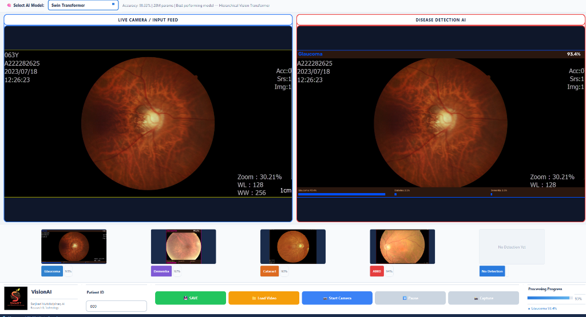
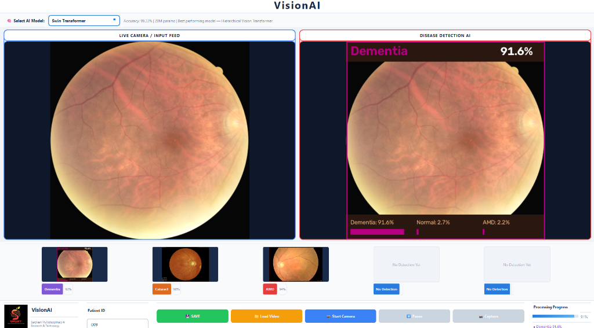
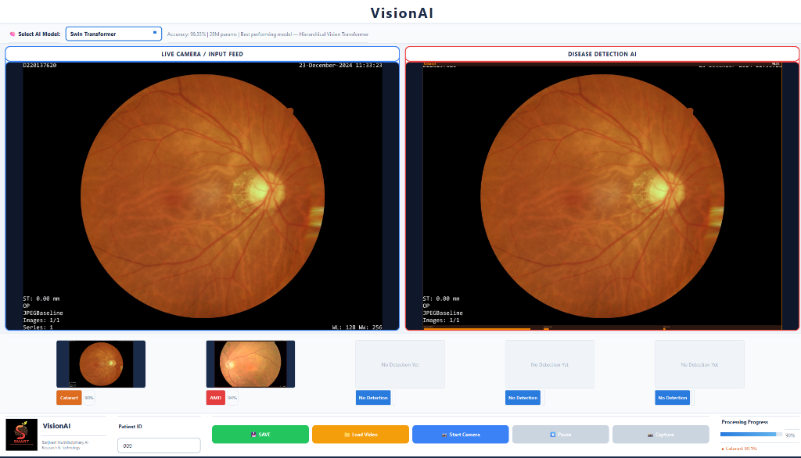
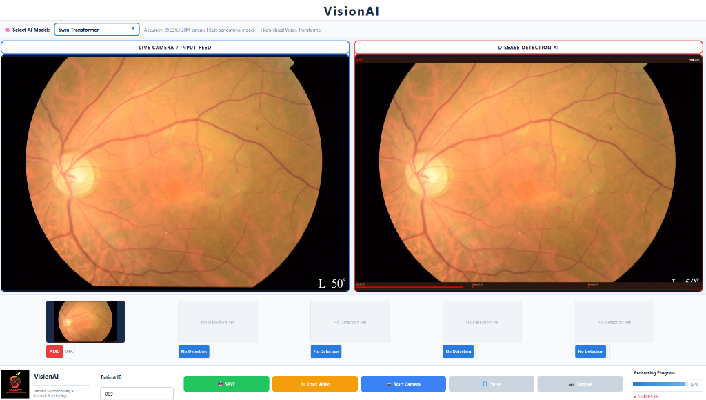

# Output Directory Structure & Diagnostic Visualizations

This directory contains generated diagnostic output images, model prediction heatmaps, real-time camera feed results, and clinical report previews produced by the **VisionAI Eye Disease Detection System**.

---

## 📁 Output Folder Structure

```
Output/
├── 📂 Output_Imgs/                        # Generated visual prediction outputs & GUI screenshots
│   ├── 🖼️ visionai_interface_idle.png    # Main desktop interface in ready state
│   ├── 🖼️ visionai_glaucoma_detection.png # Glaucoma pathology detection (93.4% confidence)
│   ├── 🖼️ visionai_dementia_detection.png # Dementia retinal biomarker detection (91.6% confidence)
│   ├── 🖼️ visionai_cataract_detection.png # Cataract diagnostic detection (90.1% confidence)
│   ├── 🖼️ visionai_amd_detection.png      # Age-Related Macular Degeneration (AMD) detection (94.3% confidence)
│   └── 🖼️ visionai_detection_result.png   # Full clinical AI diagnosis view (Cataract 90.1%)
└── 📄 README.md                           # Documentation of output formats & results
```

---

## 🖼️ Application Interface & Detection Results

### 1. Main Application Desktop Interface (Idle / Initializing State)
The primary clinical GUI featuring multi-model architecture selection (Swin Transformer, EfficientNetV2, FNet, Perceiver), dual-pane feed (Live Camera / Input vs. Disease Detection AI), patient ID entry, and action controls (Save, Load Video, Start Camera, Pause, Capture).


---

### 2. Glaucoma AI Detection Result (93.4% Confidence)
Real-time fundus photograph analysis identifying ocular hypertension and optic disc cup-to-disc ratio changes consistent with Glaucoma.



---

### 3. Dementia Retinal Biomarker Detection Result (91.6% Confidence)
Detection of microvascular and structural retinal biomarkers indicative of neurodegenerative changes associated with Dementia.



---

### 4. Cataract Diagnostic Detection Result (90.1% Confidence)
Automated screening highlighting crystalline lens opacity and fundus blur characteristics corresponding to Cataract.



---

### 5. Age-Related Macular Degeneration (AMD) Result (94.3% Confidence)
Retinal fundus image classification detecting macular lesions and drusen deposits associated with AMD.



---

### 6. Full Clinical AI Diagnosis View
Demonstration of real-time fundus photograph analysis in the dual-pane workflow viewer. The AI system segments retinal features and computes multi-class probability scores, updating the patient record and status panel dynamically.


---

## 📋 Generated Output Formats

1. **Output Images (`Output_Imgs/*.png`)**:
   - High-resolution annotated fundus scans with diagnostic overlays.
   - Screenshots of diagnostic runs for patient records.
2. **Patient Records & Reports**:
   - Text reports summarizing top-3 class confidences and diagnostic metrics.
   - Structured JSON records (`result_YYYY-MM-DD.json`) for clinical EHR integration.

