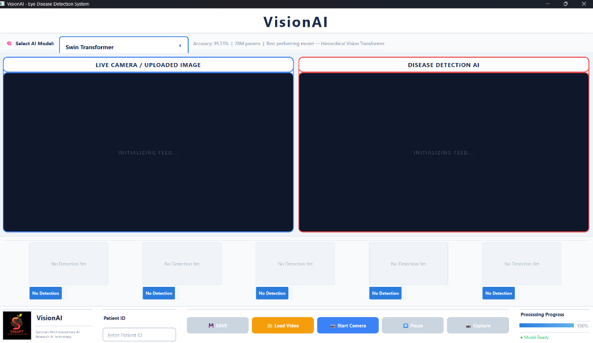
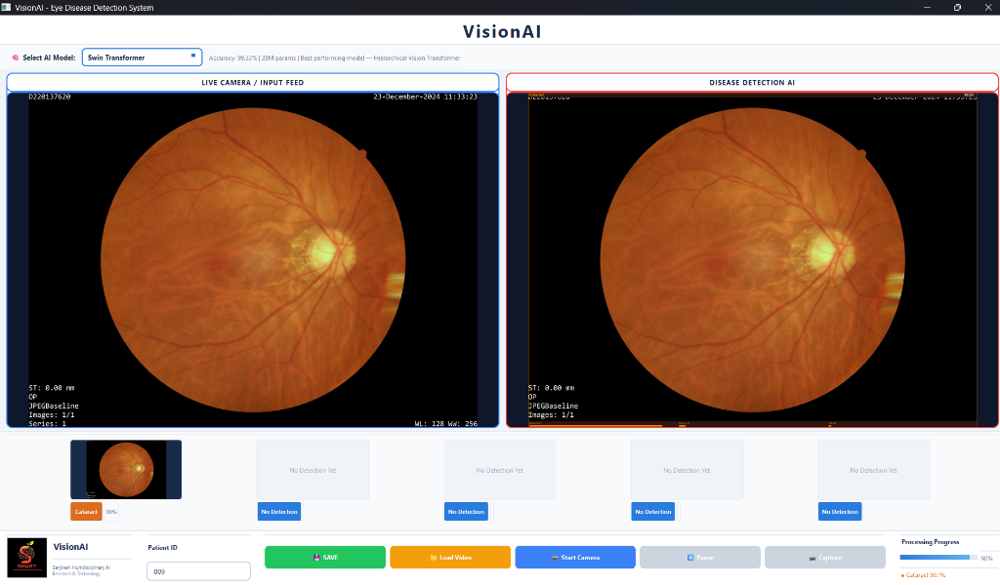

# Output Directory Structure & Diagnostic Visualizations

This directory contains generated diagnostic output images, model prediction heatmaps, real-time camera feed results, and clinical report previews produced by the **VisionAI Eye Disease Detection System**.

---

## 📁 Output Folder Structure

```
Output/
├── 📂 Output_Imgs/                      # Generated visual prediction outputs & GUI screenshots
│   ├── 🖼️ visionai_interface_idle.png  # Main desktop interface in ready state
│   └── 🖼️ visionai_detection_result.png# Live AI fundus diagnosis result (Cataract 90.1%)
└── 📄 README.md                         # Documentation of output formats & results
```

---

## 🖼️ Application Interface & Detection Results

### 1. Main Application Desktop Interface (Idle / Initializing State)
The primary clinical GUI featuring multi-model architecture selection (Swin Transformer, EfficientNetV2, FNet, Perceiver), dual-pane feed (Live Camera / Input vs. Disease Detection AI), patient ID entry, and action controls (Save, Load Video, Start Camera, Pause, Capture).



---

### 2. Live Fundus AI Pathology Detection Result
Demonstration of real-time fundus photograph analysis. The AI system segments retinal features and computes multi-class probability scores (e.g., **Cataract 90.1%** confidence), updating the patient record and status panel dynamically.



---

## 📋 Generated Output Formats

1. **Output Images (`Output_Imgs/*.png`)**:
   - High-resolution annotated fundus scans with diagnostic overlays.
   - Screenshots of diagnostic runs for patient records.
2. **Patient Records & Reports**:
   - Text reports summarizing top-3 class confidences and diagnostic metrics.
   - Structured JSON records (`result_YYYY-MM-DD.json`) for clinical EHR integration.

